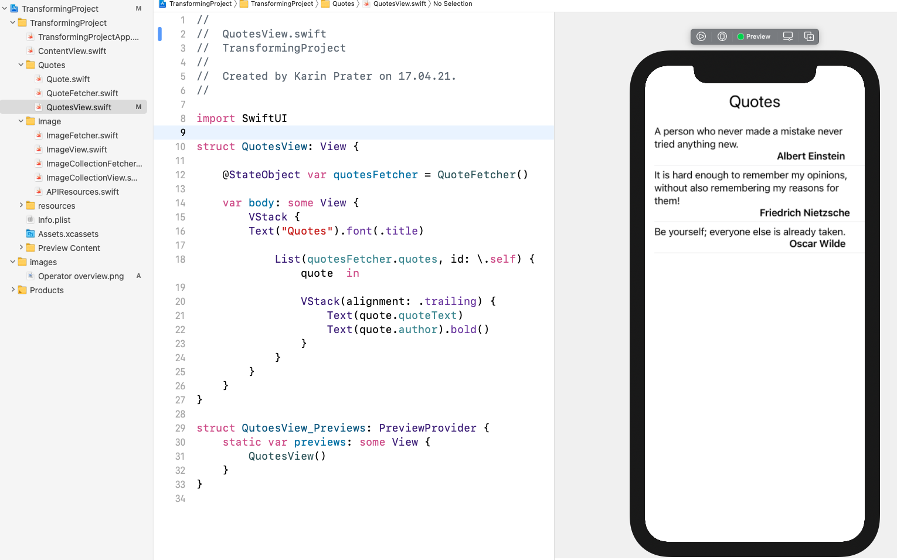

# Example project for Combine Transforming Operators 

show case how to use Combine operators for transforming values

This is part of an Youtube tutorial series. You can watch:
- [Combine framework tutorial - Part 1 - transforming Operators map, compactMap and tryMap](https://youtu.be/HE83lN_XteA)
- [Combine framework tutorial - Part 2 -  nested publisher streams with switchToLatest and flatMap](https://youtu.be/BuJVtaif76c)
- [Combine framework tutorial - Part 3 -  Error handling with mapError, setFailureType, & flatMap](https://youtu.be/M96zPRKC6Ao) 
- [Combine framework tutorial - Part 4 - How to include unit testing and dependency injection](https://youtu.be/2Cjs6bRGStU)

 
## Overview of Combine operators for transforming and error handling:

##  Demonstration of Transforming operators - Part 1

using map, tryMap, compactMap and decode

   

##  Nested Publisher streams with switchToLatest - Part 2
- fetching images with URLSession dataTaskPublisher

   

## Demonstration of flatMap and error handling in ImageCollectionView and ImageCollectionFetcher
- nested publisher streams with flatMap
- fetching images with URLSession dataTaskPublisher
- error handling with 

   
